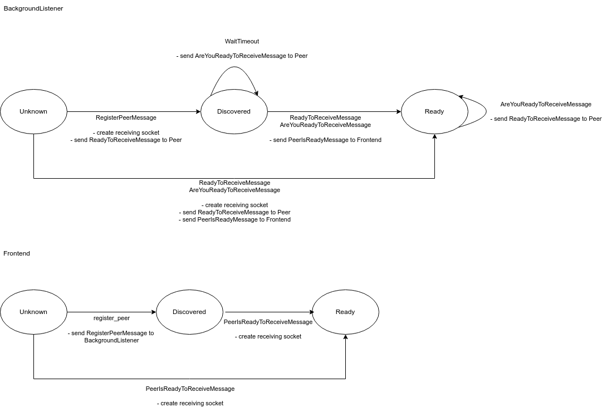

UDF Discovery and Communication
===============================

===============
Local Discovery
===============

*********
Overview:
*********

- UDP Broadcast for the initial PingMessage with connection information for the receiving socket of the reliable network
- After receiving PingMessage:

  - Create sending socket for peer to its receiving socket of the reliable network
  - Send a ReadyToReceiveMessage with our connection information for the receiving socket
    over our sending socket for it to inform the peer that we are ready to receive from it

- After receiving ReadyToReceiveMessage on our receiving socket:

  - If not yet discovered, we create a sending socket for the peer to its receiving socket of the reliable network
  - Send a ReadyToReceiveMessage with our connection information for the receiving socket
    over our sending socket for it, in case we didn't get its PingMessage.
  - If we didn't get a ReadyToReceiveMessage message after a certain time , yet, we send a AreYouReadyToReceiveMessage to a discovered peer
    - This should prevent a stuck handshake if we should lose a ReadyToReceiveMessage for whatever reason

- After receiving AreYouReadyToReceiveMessage:

  - If not yet discovered, we create a sending socket for the peer to its receiving socket of the reliable network
  - Send a ReadyToReceiveMessage with our connection information for the receiving socket
    over our sending socket for it, in case we didn't get its PingMessage.

********
Details:
********

We seperated the Local Discovery into two components. The component LocalDiscovery implements
the discovery via UDP Broadcast. The component PeerCommunicator handles the reliable network.

If the LocalDiscovery recieves a PingMessage via UDP it registers the connection info for
the reliable network of the peer with the PeerCommunicator.

The PeerCommunicator then handles the reliable network communication.
This includes sending and receiving the ReadyToReceiveMessage or AreYouReadyToReceiveMessage.
It also provides an interface for the user of the library to check if all peers are connected, which peers are there
and to send and receive message from these peers.

The PeerCommunicator can be used with different discovery strategies.
The LocalDiscovery is one, but the GlobalDiscovery can use it as well to form the reliable networks between the leaders.

The current implmentation of the PeerCommunicator use ZMQ for the reliable communication,
because it abstracts away the low-level network. It provides:

- A message-based interface, instead the stream-based inteface of TCP.
- Asynchronous message queue, instead of synchronous TCP socket

  - Being asynchronous means that the timings of the physical connection setup and tear down,
    reconnect and effective delivery are transparent to the user and organized by ZeroMQ itself.
  - Further, messages may be queued in the event that a peer is unavailable to receive them.

