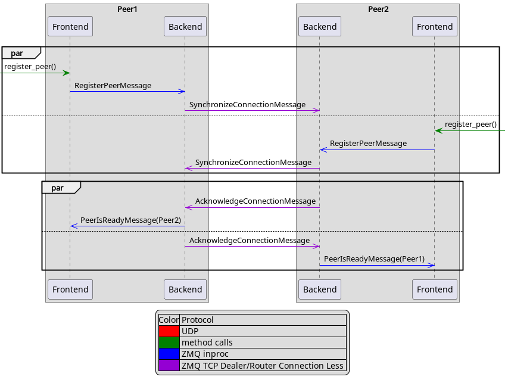
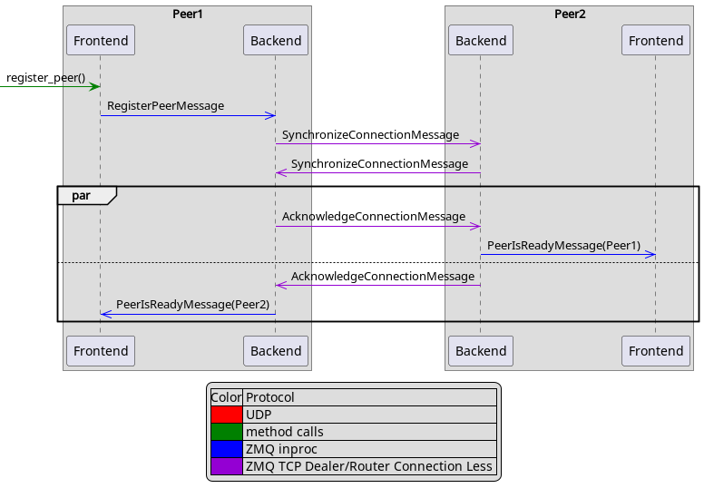
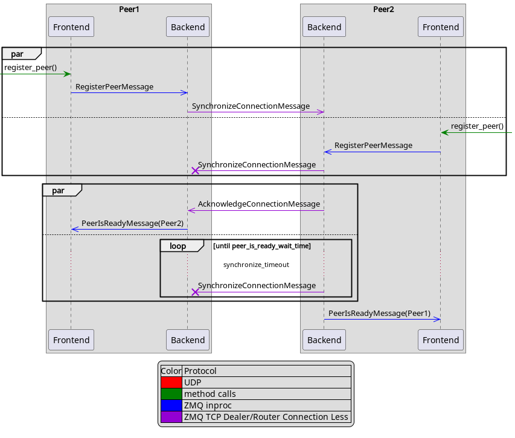
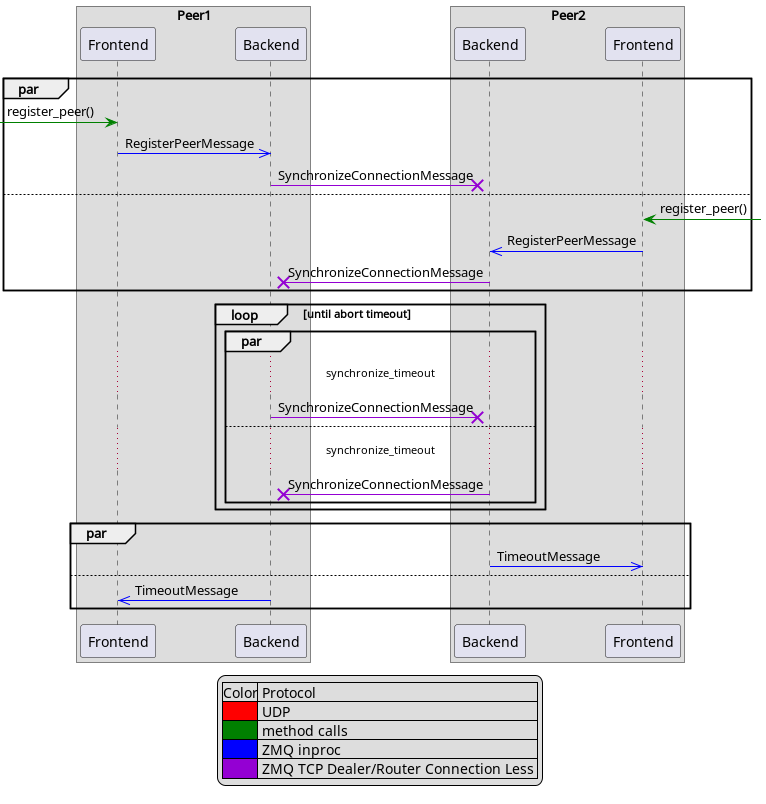
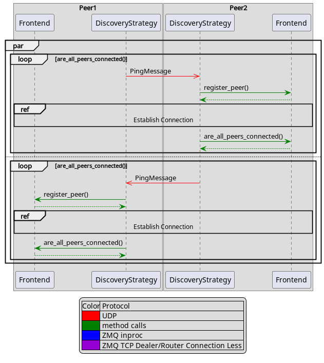
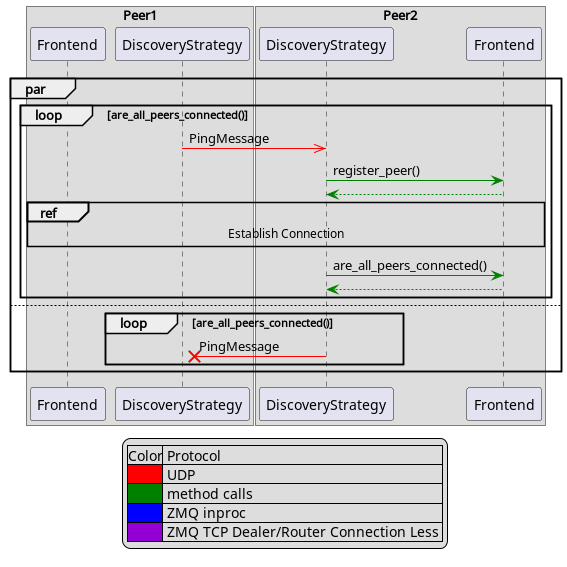
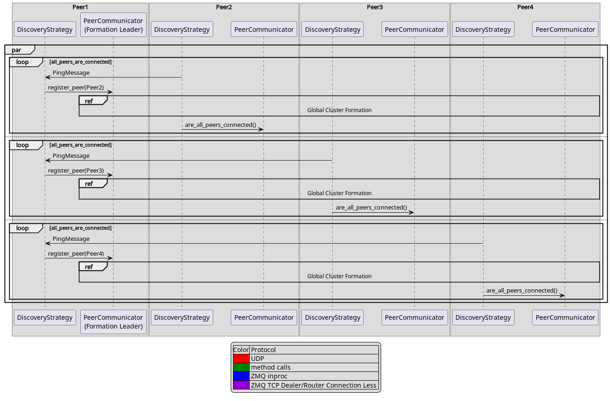
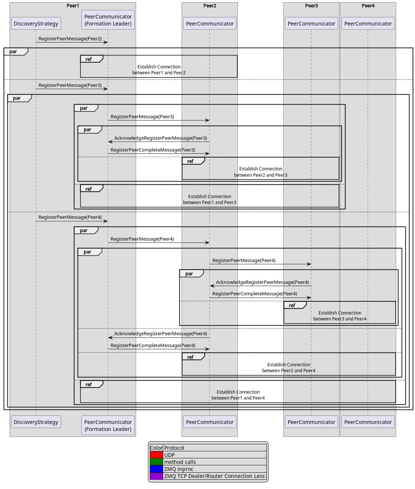

UDF Discovery and Communication
===============================

===================
Establish Connection
===================

* We use a protocol similar to the TCP Handshake for establishing the connection
* However, our protocol has two different requirements compared to TCP:

  * Two peers can establish the connection at the same time
  * In case of lost messages, one of the peers in a connection can successful terminate

* To handle, these two requirements, we add the following modification:

  * We allow both peers to send a synchronize at the same time
  * When a peer receives the `SynchronizeConnectionMessage` from the second peer

    * It sends first a `SynchronizeConnectionMessage` and `AcknowledgeConnectionMessage` back
    * It can mark the second peer as ready, after it waited for the peer_is_ready_wait_time

* Both peers register each other:

* One peer registers the other peer:

* Both peers register each other, one peer loses the `SynchronizeConnectionMessage`:

* Both peers register each other, both lose the `SynchronizeConnectionMessage`:

* State diagram:

.. image:: establish_connection/state_diagram.png

========================
Local Discovery Strategy
========================

- The Local Discovery Strategy sends `PingMessage` with connection information
  for establishing the connection via UDP Broadcast.
- When a peer receives a `PingMessage` from another peer.
  it registers the other peer and treis to establish a connection
- The strategy sends and receives UDP Broadcast messages until all other peers are connected

- Both peers receive `PingMessage`:

- One peer receive `PingMessage`:

=========================
Global Discovery Strategy
=========================

The Global Discovery Strategy is more complex, because we can't use UDP Broadcast between nodes. Cloud provider and
other data centers often block UDP Broadcast between different servers. For that reason, we choose a different
mechanism. Before, we start the UDFs we choose one data node by random to be the global cluster formation leader.
Further, we choose a random port on which the local leader on the designated node will listen for `PingMessge`'s
from the other data nodes.
We need first the local discovery and cluster formation to reduce the number of Peer's for the global cluster discovery,
because otherwise too many Peer's would try to connect designated node. Furthermore, we wouldn't know which UDF instance
should listen for the `PingMessage`'s on the designated node.

========================
Global Cluster Formation
========================

After, the Global Cluster Formation Leader received a `PingMessage` of a Peer it needs to forward this information
to all other Peer's. The simplest but most inefficient way to do it, is when the Leader waits for the PingMessage
of each Peer and sends the list of all the other Peer's to each Peer. This causes higher load on the Leader and
all other Peer's are more or less idling.
For that reason, we chose a more distributed algorithm where the Peer's form a chain with the Leader in the beginning.
Each Peer forwards the received `RegisterPeerMessage`'s to the next Peer in the chain.

