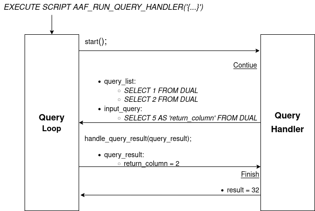

# Advanced Analytics Framework User Guide

The Advanced Analytics Framework (AAF) enables implementing complex data analysis algorithms with Exasol. Users can use the features of AAF in their custom implementations.

AAF employs Lua scripts and User Defined Functions (UDFs). The Lua scripts are orchestrating the UDFs while the UDFs are performing the actual analytic functions.

AAF keeps a common state of execution and passes input data and results between Lua and UDFs via files in the Bucket File System (BucketFS) of the Exasol database.

Table of Contents

* [Setup](#setup)
* [Usage](#usage)
* [Custom Algorithms](#custom-algorithms)

## Setup

### Exasol database

* The Exasol cluster must already be running with version 7.1 or later.
* Database connection information and credentials are needed for the database itself as also for the BucketFS.

### BucketFS Connection

The following SQL statements create a connection to the BucketFS used to transfer data between the Lua scripts and the UDFs:

```sql
CREATE OR REPLACE CONNECTION '<CONNECTION_NAME>'
TO '{
  "backend": "<BACKEND>",
  "url": "<HOST>:<PORT>",
  "service_name": "<SERVICE_NAME>",
  "bucket_name": "<BUCKET_NAME>",
  "path": "<PATH>",
  "verify": <VERIFY>,
  "host": "<SAAS_HOST>",
  "account_id": "<SAAS_ACCOUNT_ID>",
  "database_id": "<SAAS_DATABASE_ID>",
  "pat": "<SAAS_PAT>"
  }'
USER '{"username": "<USER_NAME>"}'
IDENTIFIED BY '{"password": "<PASSWORD>"}' ;
```

The list of elements in the connection's parameter called `TO` depends on the backend you want to use. There are two different backends: `onprem` and `saas`.

The following table shows all elements for each of the backends.

| Backend  | Parameter            | Required? | Default value  | Description                                                        |
|----------|----------------------|-----------|----------------|--------------------------------------------------------------------|
| (any)    | `<CONNECTION_NAME>`  | yes       | -              | Name of the connection                                             |
| (any)    | `<USER_NAME>`        | -         | `true`         | Name of the user accessing the Bucket (requires  write permissions) |
| (any)    | `<PASSWORD>`         | -         | `true`         | Password for accessing the Bucket (requires  write permissions)    |
| (any)    | `<BACKEND>`          | yes       | -              | Which backend to use, must be either `onprem` or `saas`            |
| `onprem` | `<HOST>`             | yes       | -              | Fully qualified Hostname or ip Address                             |
| `onprem` | `<PORT>`             | -         | `2580`         | Port of the BucketFS Service                                       |
| `onprem` | `<SERVICE_NAME>`     | yes       | `bfsdefault`   | Name of the BucketFS Service                                       |
| `onprem` | `<BUCKET_NAME>`      | yes       | `default`      | Name of the Bucket                                                 |
| `onprem` | `<PATH>`             | -         | (empty / root) | Path inside the Bucket                                             |
| `onprem` | `<VERIFY>`           | -         | `true`         | Whether to apply TLS security to the connection                    |
| `saas`   | `<SAAS_ACCOUNT_ID>`  | yes       | -              | Account ID for accessing an SaaS database instance                 |
| `saas`   | `<SAAS_DATABASE_ID>` | yes       | -              | Database ID of an Exasol SaaS database instance                    |
| `saas`   | `<SAAS_PAT>`         | yes       | -              | Personal access token for accessing an SaaS database instance      |

### AAF Python Package

The latest version of AAF can be obtained from [pypi](https://pypi.org), see also the [releases on GitHub](https://github.com/exasol/advanced-analytics-framework/releases):

```bash
pip install exasol-advanced-analytics-framework
```

### Script Language Container (SLC)

Exasol executes User Defined Functions (UDFs) in an isolated Container whose root filesystem is derived from a Script Language Container (SLC).

Running the AAF requires an SLC. The following command
* downloads the specified version `<VERSION>` (preferrably the latest) of a prebuilt AAF SLC from the [AAF releases](https://github.com/exasol/advanced-analytics-framework/releases/latest) on GitHub,
* uploads the file into the BucketFS,
* and registers it to the database.

The variable `$LANGUAGE_ALIAS` will be reused in [Additional Scripts](#additional-scripts).

```shell
LANGUAGE_ALIAS=PYTHON3_AAF
python -m exasol_advanced_analytics_framework.deploy language-container \
    --dsn "$DB_HOST:$DB_PORT" \
    --db-user "$DB_USER" \
    --db-pass "$DB_PASSWORD" \
    --bucketfs-name "$BUCKETFS_NAME" \
    --bucketfs-host "$BUCKETFS_HOST" \
    --bucketfs-port "$BUCKETFS_PORT" \
    --bucketfs-user "$BUCKETFS_USER" \
    --bucketfs-password "$BUCKETFS_PASSWORD" \
    --bucket "$BUCKETFS_NAME" \
    --path-in-bucket "$PATH_IN_BUCKET" \
    --version "$VERSION" \
    --language-alias "$LANGUAGE_ALIAS"
```

### Additional Scripts

Besides the BucketFS connection, the SLC, and the Python package AAF also requires some additional Lua scripts to be created in the Exasol database.

The following command deploys the additional scripts to the specified `DB_SCHEMA` using the `LANGUAGE_ALIAS` of the SLC:

```shell
python -m exasol_advanced_analytics_framework.deploy scripts \
    --dsn "$DB_HOST:DB_PORT" \
    --db-user "$DB_USER" \
    --db-pass "$DB_PASSWORD" \
    --schema "$AAF_DB_SCHEMA" \
    --language-alias "$LANGUAGE_ALIAS"
```

When later on [executing the script](#placeholders) you must use the schema name `AAF_DB_SCHEMA` or make it the current schema.

## Usage

The entry point of this framework is `AAF_RUN_QUERY_HANDLER` script. This script is simply a query loop which is responsible for executing the implemented algorithm.

This script takes the necessary parameters to execute the desired algorithm in string json format. The json input includes two main parts:

* `query_handler` : Details of the algorithm implemented by the user.
* `temporary_output`:  Information where the temporary outputs (such as tables, bucketfs files, ...) of the query handler are kept. These temporary outputs will be removed after the execution of the QueryHandler.

The following SQL statement shows how to call an AAF query handler:

```sql
EXECUTE SCRIPT "<AAF_DB_SCHEMA>"."AAF_RUN_QUERY_HANDLER"('{
    "query_handler": {
        "factory_class": {
            "module": "<CLASS_MODULE>",
            "name": "<CLASS_NAME>"
        },
        "parameter": "<CLASS_PARAMETERS>",
        "udf": {
            "schema": "<UDF_DB_SCHEMA>",
            "name": "<UDF_NAME>"
        }
    },
    "temporary_output": {
        "bucketfs_location": {
            "connection_name": "<BUCKETFS_CONNECTION_NAME>",
            "directory": "<BUCKETFS_DIRECTORY>"
        },
        "schema_name": "<TEMP_DB_SCHEMA>"
    }
}');
```

See [Implementing a Custom Algorithm as Example Query Handler](#implementing-a-custom-algorithm-as-example-query-handler) for a complete example.

### Placeholders

| Placeholders                 | Required? | Description                                                                   |
|------------------------------|-----------|-------------------------------------------------------------------------------|
| `<AAF_DB_SCHEMA>`            | yes       | Name of the database schema containing the default Query Handler, See [Additional Scripts](#additional-scripts) |
| `<CLASS_NAME>`               | yes       | Name of the query handler class                                               |
| `<CLASS_MODULE>`             | yes       | Module name of the query handler class                                        |
| `<CLASS_PARAMETERS>`         | yes       | Parameters of the query handler class encoded as string                       |
| `<UDF_NAME>`                 | -         | Name of Python UDF script that contains the algorithm implemented by the user |
| `<UDF_DB_SCHEMA>`            | -         | Schema name where the UDF script is deployed                                  |
| `<BUCKETFS_CONNECTION_NAME>` | yes       | BucketFS connection name which is used to create temporary bucketfs files     |
| `<BUCKETFS_DIRECTORY>`       | yes       | Directory in BucketFS for the temporary bucketfs files                        |
| `<TEMP_DB_SCHEMA>`           | yes       | Database Schema for temporary database objects, e.g. tables                   |

The value of `<CLASS_PARAMETERS>` will be converted into a String, however, Json objects or arrays currently are represented as unusable references, e.g. `table: 0x14823bd38580`, which will be fixed with issue [#196](https://github.com/exasol/advanced-analytics-framework/issues/196).

## Custom Algorithms

### Deployment Options

Using the AAF requires to implement a custom algorithm using one of the following alternatives
* [Build a custom extension](#building-a-custom-extension)
* [Adhoc implementation within a UDF](#concrete-example-using-an-adhoc-implementation-within-the-udf)

### Implementing a Custom Algorithm as Query Handler

Each algorithm should extend the `UDFQueryHandler` abstract class and then implement the following methods:
* `start()`: This method is called at the first execution of the query hander, that is, in the first iteration. It returns a result object: Either _Finish_ or _Continue_.
  * The _Finish_ result object contains the final result of the implemented algorithm.
  * The _Continue_ object contains the query list that will be executed before the next iteration and whose results are used as input for the next iteration.
* `handle_query_result()`: This method is called at the following iterations to handle the result of the queries of the previous iteration.

### Building a Custom Extension

* Create a python package that depends on the python package of the AAF and that implements the query handler of the custom algorithm and its factory class.
* Create an associated SLC which has the python package installed. GitHub repository [python-extension-common](https://github.com/exasol/python-extension-common/) provides more detailed documentation and automation.
* Leave out entry `udf` from the json input to use the default UDF.
* Values `<CLASS_MODULE>` and `<CLASS_NAME>` must reflect the _module_ and _class name_ of the `QueryHandler` implemented in the custom SLC.

### Concrete Example Using an Adhoc Implementation Within the UDF

The example dynamically creates a python module `example_module` and adds classes `ExampleQueryHandler` and `ExampleQueryHandlerFactory` to it.

In order to execute the example successfully you need to
1. [Create a BucketFS connection](#bucketfs-connection)
2. Activate the AAF's SLC
3. Make sure the database schemas used in the example exist.

The example assumes
* the name for the BucketFS Connection `<CONNECTION_NAME>` to be `BFS_CON`
* the name for the AAF database schema `<AAF_DB_SCHEMA>` to be `AAF_DB_SCHEMA`, see [Additional Scripts](#additional-scripts)

The following SQL statements create the required database schemas unless they already exist:

```sql
create schema IF NOT EXISTS "EXAMPLE_SCHEMA";
create schema IF NOT EXISTS "EXAMPLE_TEMP_SCHEMA";
```

The following files contain the SQL statements for creating and executing the UDF script
* [example-udf-script/create.sql](example-udf-script/create.sql)
* [example-udf-script/execute.sql](example-udf-script/execute.sql)

### Sequence Diagram

The figure below illustrates the execution of this algorithm implemented in class `ExampleQueryHandler`.
* When method `start()` is called, it executes two queries and an additional `input_query` to obtain the input for the next iteration.
* After the first iteration is completed, the framework calls method the `handle_query_result` with the `query_result` of the `input_query` of the previous iteration.

In this example, the algorithm is finished at this iteration and returns 2<sup>_return value_</sup> as final result.



## Additional Information

* [Object Proxies](proxies.md) for managing temporary locations in the database and BucketFS
