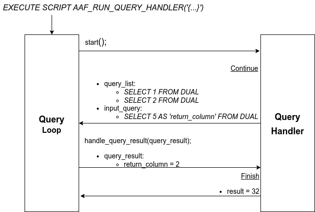

# Advanced Analytics Framework User Guide

The Advanced Analytics Framework (AAF) provides a general framework to implement complex data analysis algorithms with Exasol. Users can use the features of AAF in their custom implementations.

## Table of Contents

* [Setup](#setup)
* [Usage](#usage)
* [Implementation of Algorithms](#implementation-of-algorithms)

## Setup

### Exasol database

* The Exasol cluster must already be running with version 7.1 or later.
* Database connection information and credentials are needed.

### BucketFS Connection

AAF employs some Lua scripts and User Defined Functions (UDFs).  The Lua
scripts are orchestrating the UDFs while the UDFs are performing the actual
analytic functions.

AAF keeps a common state of execution and passes input data and results
between Lua and UDFs via files in the Bucket File System (BucketFS) of the
Exasol database.

<!-- For keeping a common state of execution and passing input data and
results between Lua and UDFs AAF requires to access the Bucket File System
(BucketFS) of the Exasol database. -->

The following SQL statements create such a connection to the BucketFS:

```sql
CREATE OR REPLACE CONNECTION '<CONNECTION_NAME>'
TO '{
  "backend": "<BACKEND>",
  "url": "<HOST>:<PORT>",
  "service_name": "<SERVICE_NAME>",
  "bucket_name": "<BUCKET_NAME>",
  "path": "<PATH>",
  "verify": <VERIFY>,
  "host": "<SAAS_HOST>",
  "account_id": "<SAAS_ACCOUNT_ID>",
  "database_id": "<SAAS_DATABASE_ID>",
  "pat": "<SAAS_PAT>"
  }'
USER '{"username": "<USER_NAME>"}'
IDENTIFIED BY '{ "password": "<PASSWORD>"}' ;
```

The list of elements in the connection's parameter called `TO` depends on the
backend you want to use. There are two different backends: `onprem` and
`saas`.

The following table shows all elements for each of the backends.

| Backend  | Parameter            | Required? | Default value  | Description                                                        |
|----------|----------------------|-----------|----------------|--------------------------------------------------------------------|
| (any)    | `<CONNECTION_NAME>`  | yes       | -              | Name of the connection                                             |
| (any)    | `<USER_NAME>`        | -         | `true`         | Name of the user accessing the Bucket (requires  write permissions) |
| (any)    | `<PASSWORD>`         | -         | `true`         | Password for accessing the Bucket (requires  write permissions)    |
| (any)    | `<BACKEND>`          | yes       | -              | Which backend to use, must be either `onprem` or `saas`            |
| `onprem` | `<HOST>`             | yes       | -              | Fully qualified Hostname or ip Address                             |
| `onprem` | `<PORT>`             | -         | `2580`         | Port of the BucketFS Service                                       |
| `onprem` | `<SERVICE_NAME>`     | yes       | `bfsdefault`   | Name of the BucketFS Service                                       |
| `onprem` | `<BUCKET_NAME>`      | yes       | `default`      | Name of the Bucket                                                 |
| `onprem` | `<PATH>`             | -         | (empty / root) | Path inside the Bucket                                             |
| `onprem` | `<VERIFY>`           | -         | `true`         | Whether to apply TLS security to the connection                    |
| `saas`   | `<SAAS_ACCOUNT_ID>`  | yes       | -              | Account ID for accessing an SaaS database instance                 |
| `saas`   | `<SAAS_DATABASE_ID>` | yes       | -              | Database ID of an Exasol SaaS database instance                    |
| `saas`   | `<SAAS_PAT>`         | yes       | -              | Personal access token for accessing an SaaS database instance      |

### The Python Package

#### Download The Python Wheel Package

The latest version of the python package of the framework can be downloaded from the Releases in GitHub Repository (see [the latest release](https://github.com/exasol/advanced-analytics-framework/releases/latest)).

Please download the archive `advanced_analytics_framework.whl`.

#### Install The Python Wheel Package

The following command installs the package `advanced-analytics-framework` from [pypi](https://pypi.org):

```bash
pip install exasol-advanced-analytics-framework
```

### The Pre-built Script Language Container (SLC)

#### Download SLC

* Running the framework requires a custom script language container (SLC).
* Please download the SLC from the releases in GitHub Repository, see [the latest release](https://github.com/exasol/advanced-analytics-framework/releases/latest).

#### Install SLC

Installing the SLC requires loading the container file into the BucketFS and registering it to the database:

```shell
python -m exasol_advanced_analytics_framework.deploy language-container
    --dsn <DB_HOST:DB_PORT> \
    --db-user <DB_USER> \
    --db-pass <DB_PASSWORD> \
    --bucketfs-name <BUCKETFS_NAME> \
    --bucketfs-host <BUCKETFS_HOST> \
    --bucketfs-port <BUCKETFS_PORT> \
    --bucketfs-user <BUCKETFS_USER> \
    --bucketfs-password <BUCKETFS_PASSWORD> \
    --bucket <BUCKETFS_NAME> \
    --path-in-bucket <PATH_IN_BUCKET> \
    --language-alias <LANGUAGE_ALIAS> \
    --container-file <path/to/language_container.tar.gz>
```

### Deployment

Deploy all necessary scripts installed in the previous step to the specified `SCHEMA` in Exasol DB with the same `LANGUAGE_ALIAS` using the following python cli command:

```shell
python -m exasol_advanced_analytics_framework.deploy scripts
    --dsn <DB_HOST:DB_PORT> \
    --db-user <DB_USER> \
    --db-pass <DB_PASSWORD> \
    --schema <SCHEMA> \
    --language-alias <LANGUAGE_ALIAS>
```

## Usage

The entry point of this framework is `AAF_RUN_QUERY_HANDLER` script. This script is simply a Query Loop which is responsible for executing the implemented algorithm.

This script takes the necessary parameters to execute the desired algorithm in string json format. The json input includes two main part:

* `query_handler` : Details of the algorithm implemented by user.
* `temporary_output`:  Information about BucketFS where the temporary outputs of the query handler is kept.

You can find an example usage below:

```sql
EXECUTE SCRIPT AAF_RUN_QUERY_HANDLER('{
    "query_handler": {
        "factory_class": {
            "name": <CLASS_NAME>,
            "module": <CLASS_MODULE>
        },
        "parameters": <CLASS_PARAMETERS>
        "udf": {
            "name": <UDF_NAME>
            "schema": <UDF_SCHEMA_NAME>,
        },
    },
    "temporary_output": {
        "bucketfs_location": {
            "connection_name": <BUCKETFS_CONNECTION_NAME>
            "directory": <BUCKETFS_DIRECTORY>,
        },
        "schema_name": <SCHEMA_NAME>
    }
}')
```

Parameters

| Parameter                    | Optional? | Description                                                    |
|------------------------------|-----------|----------------------------------------------------------------|
| `<CLASS_NAME>`               | -         | Name of the query handler class                                |
| `<CLASS_MODULE>`             | -         | Module name of the query handler class                         |
| `<CLASS_PARAMETERS>`         | -         | Parameters of the query handler class                          |
| `<UDF_NAME>`                 | yes       | Name of Python UDF script including user-implemented algorithm |
| `<UDF_SCHEMA_NAME>`          | yes       | Schema name where the UDF script is deployed                   |
| `<BUCKETFS_CONNECTION_NAME>` | -         | BucketFS connection name to keep temporary outputs             |
| `<BUCKETFS_DIRECTORY>`       | -         | Directory in BucketFS where temporary outputs are kept         |

# Implementation of Algorithms

The algorithm should extend the `UDFQueryHandler` abstract class and then implement its following methods:
* `start()` : It is called at the first execution of the framework, that is, in the first iteration. It returns a result object: Either _Continue_ or _Finish_.
  * The _Finish_ result object contains the final result of the implemented algorith.
  * The _Continue_ object contains the query list that will be executed for the next state.
* `handle_query_result()` : This method is called at the following iterations to handle the return query. An example class definition is given below:

```python
class CustomQueryHandler(UDFQueryHandler):
    def __init__(self, parameter: str, query_handler_context: QueryHandlerContext):
        super().__init__(parameter, query_handler_context)
        self.parameter = parameter
        self.query_handler_context = query_handler_context

    def start(self) -> Union[Continue, Finish[ResultType]]:
        query_list = [
          SelectQuery("SELECT 1 FROM DUAL"),
          SelectQuery("SELECT 2 FROM DUAL")]
        query_handler_input_query = SelectQueryWithColumnDefinition(
            query_string="SELECT 5 AS 'return_column' FROM DUAL",
            output_columns=[
              Column(ColumnName("return_column"), ColumnType("INTEGER"))])

        return Continue(
            query_list=query_list,
            input_query=query_handler_return_query)

    def handle_query_result(self, query_result: QueryResult) -> Union[Continue, Finish[str]]:
        return_value = query_result.return_column
        result = 2 ** return_value
        return Finish(result=f"Assertion of the final result: 32 == {result}")
```

The figure below illustrates the execution of this algorithm implemented in `CustomQueryHandler` class. When method `start()` is called, it executes two queries and an additional `input_query` to obtain the next state.

After the first iteration is completed, the framework calls the `handle_query_result` method with the `query_result` of the `input_query` of the previous iteration.  In this example, the algorithm is finished at this state, presents the two to the power of the return value as final result.


